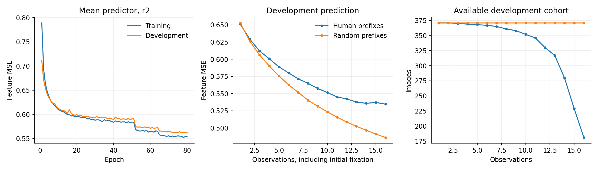
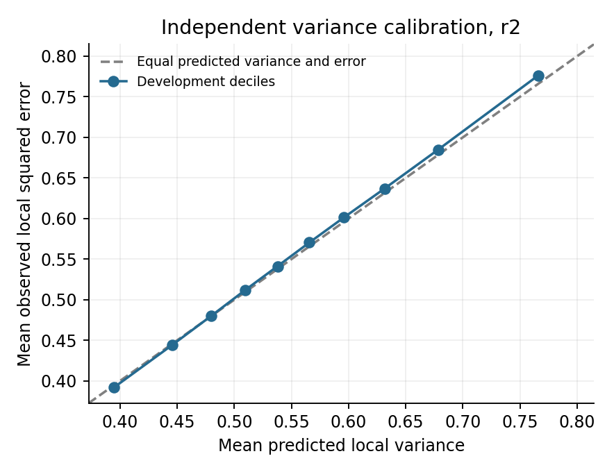

# Active sensing with uncertainty and prediction gain

Do people look toward uncertain locations, or toward locations expected to improve their understanding of a scene? This project compares three candidate values under limited visual access:

- **U:** current predictive uncertainty near a candidate fixation.
- **Local G:** expected reduction in prediction error near that fixation.
- **Global G:** expected reduction in prediction error across the image.

We measure both how well these signals guide model observation and how well they predict human next fixations. Success on one does not establish success on the other.

## Current results

Snapshot: October 6, 2026. The current observer uses continuous foveation, revision r2, and up to 16 observations. Mean and variance training are complete. New gain labels are being generated; current-version policy and human-choice results are pending.

| Development measurement | Result |
| --- | ---: |
| Images | 371 |
| Mean predictor feature MSE | 0.5618 |
| Direct partial-view DINO feature MSE | 0.8476 |
| Zero prediction in standardized feature space, MSE | 0.9976 |
| Selected mean epoch, out of 80 allowed | 80 |
| Predicted local variance / observed squared error | 0.9938 |
| Within-state variance/error Spearman correlation | 0.7642 |



MSE averages available budgets within history type, human/random types equally, and images equally. These fixed development histories are not the final all-participant comparison. The human cohort shrinks at later budgets. The best epoch was the budget limit; convergence is not claimed.



Calibration covers 10,719 states and 1,967,936 candidate measurements. Checkpoint selection and calibration share development data. This supports proceeding to gain training, not a claim about human uncertainty.

The older hard-window experiment is documented separately: local G scored better than U on its conditional human-choice comparison, while reconstruction differences between trajectories were small. Those results do not establish the current observer's performance. See [results and limitations](docs/results.md).

## How it works

```text
Fixation history -> foveated RGB -> frozen DINOv2 -> predicted mean and variance
Before-state features + candidate geometry -> predicted local and global gains
```

The model predicts a complete 20 x 32 x 384 DINO feature map from a 448 x 280 partial view. Train the mean with MSE, freeze it, then train an independent variance head with Gaussian negative log-likelihood. Offline before/after error differences provide fresh gain labels. Online choices never access hidden target patches.

Local U and local gain use identical, fixed spatial weights. Foveation preserves a clear core and gradually blurred surroundings, accumulating the best resolution from past observations. Its scale is an engineering choice, not calibrated human acuity. [Implementation details](docs/method.md) specify the renderer, architectures, losses, and evaluation rules.

## Data and evaluation

[COCO-FreeView](https://sites.google.com/view/cocosearch/coco-freeview) provides 4,317 images and 43,048 trajectories from 10 participants. Image-disjoint splits contain 3,343 training, 371 development, and 603 internal holdout images.

These counts describe the public training/validation release used here, not the full collection. [Dataset setup](docs/dataset.md) lists all five required files, download links, checksums, an explicit-destination preparation script, and the exact split rule.

The training-only mean fixation count is 15.4577; its ceiling sets the 16-observation budget. Human replay uses each actual start and T = min(trajectory length, 16), retaining revisits and never padding short trials. Policies share that start and budget. Human-choice models control for position, movement, history, and resolution changes; DeepGaze scores use exactly matching targets.

Humans viewed normal images. Offline replay measures our model's prediction error, not human internal error. The previously inspected holdout is not a new untouched confirmation set.

## Code and reproduction

```text
foveated_v3/   Current observer, training, and evaluation
support/      Reused model and data helper sources
d_partial/    Legacy observer for comparisons
data_a/       Data audit and split construction
reference_c/  DeepGaze III behavioral reference
toy/          Analytic Gaussian examples
results/      Aggregate results, figures, and provenance
scripts/      Figure build, release checks, and export
docs/         Methods, results, reproduction, publishing
```

Training uses site-specific paths and Slurm; this is not a one-command training package. [Reproduction instructions](docs/reproduction.md) describe dependencies and execution. Figures can be rebuilt from bundled aggregates without data or checkpoints.

Full training on a fresh server is not yet reproducible without porting the site paths and archived-artifact contracts. The existing server also depends on the old video project's Python runtime; see [storage dependencies](docs/storage_dependencies.md) before deleting either `deepgaze_video` directory.

External sources: [DINOv2](https://github.com/facebookresearch/dinov2), [DeepGaze](https://github.com/matthias-k/DeepGaze), and the conceptual [foveation reference](https://github.com/ouyangzhibo/Image_Foveation_Python). Raw data, photographs, checkpoints, and third-party model source are excluded. A project license has not yet been selected. See [GitHub publishing instructions](docs/publishing.md).
