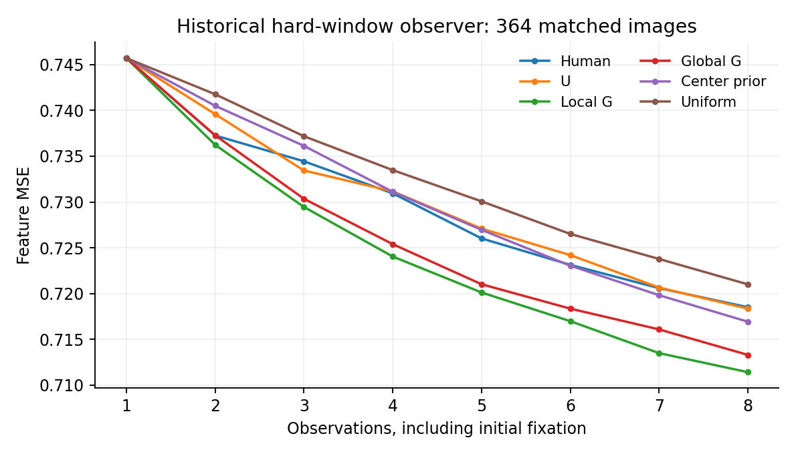

# Results

Snapshot: October 6, 2026. All figures are generated from the aggregate JSON files in `results/`. They do not require raw images or participant records.

## Current continuous observer

Mean run 22742 completed the 80-epoch budget. The best checkpoint was epoch 80, with development feature MSE 0.561805. Direct partial DINO features scored 0.847617; zero in standardized feature space scored 0.997618. These comparisons share target normalization and the same development states. There is no demonstrated plateau at the budget limit.

Development contains 371 images and 11,271 supported states from fixed human/random histories. First average available budgets within history type, then the two types equally, then images equally. This differs from the final all-participant evaluation protocol. The human curve changes cohort as trajectories end; the random curve has 371 images at every budget. Paired adjacent-step results are also retained in `mean_metrics.json`.

Variance run 22754 selected epoch 39. Candidate calibration covers 371 images, 10,719 states, and 1,967,936 measurements. Mean predicted variance / mean squared error is 0.993828; normalized decile calibration error is 0.007605; image-macro within-state Spearman correlation is 0.764176. Selected development NLL is 1.095302 versus 1.121128 for the constant variance baseline.

The review accepted this variance head for new gain training. It did not validate a human uncertainty mechanism. Checkpoint selection and calibration share development data, and policy-induced histories may differ from the calibration histories.

New gain generation is running in job 22779. Current closed-loop and human-choice comparisons are pending. The earlier broad observer revision was superseded; none of its images or results are presented as r2.

## Historical hard-window experiment

These are completed results from the old observer, with eight observations. The primary comparison includes 364 common images, one preselected human trajectory per image, shared initial fixation, and policy paths rescored with the human paths on the same device. Random/center seeds are averaged within image. This is a different observation model and budget from the current experiment.

| Trajectory | Feature MSE at observation 8 |
| --- | ---: |
| Human | 0.718516 |
| U | 0.718354 |
| Local G | 0.711424 |
| Global G | 0.713309 |
| Center prior | 0.716930 |
| Uniform | 0.721008 |

The small terminal differences motivated revisiting the observation model. They do not prove that the old predictor was broken, that human gaze optimizes this feature loss, or that the current observer improves policy separation. This historical table must not be used as a current-version result. The source is run 22581.

## Gaussian examples

The analytic Gaussian examples separate uncertainty, observation quality, and cross-region benefit. Independent exact observations make U and G agree. High observation noise can make the most uncertain location less useful. Correlation can make global gain prefer a location that helps other regions. Local G isolates the contribution from cross-region benefit. The original simulation used 200,000 samples per case; 14 means agreed with the formula within five Monte Carlo standard errors. The figures show Monte Carlo uncertainty, not uncertainty about human behavior.

## Evidence

`results/provenance.json` records source runs, upstream hashes, and checkpoint identities. `results/SHA256SUMS` binds the public aggregate inputs. Full checkpoints, raw data, run logs, and per-state caches remain in private experiment storage and are not bundled in this release. Descriptive intervals and development calibration must not be relabeled as independent confirmatory inference. The earlier holdout has already been inspected.

## Historical human choice

The completed hard-window human-choice evaluation, run 22517, scored 17,837 targets on 603 held-out images at supported before-budgets 1, 4, and 7. Conditional models used the same targets and spatial/history controls. The image-macro local-G minus U log-likelihood difference was 0.056366 nats, with interval [0.046751, 0.065979]. On the fixed disagreement subset, it was 0.043222 nats, with interval [0.020229, 0.065933], across 2,452 targets and 541 images.

These are individual 97.5% paired-image intervals for two fixed primary comparisons, giving a Bonferroni 95% family. They are not the descriptive 95% intervals used elsewhere. DeepGaze's full-image reference scored better overall. These results favor one fitted conditional predictor within that old setup; they do not establish a uniquely identified psychological mechanism. This holdout was subsequently inspected and cannot serve as untouched confirmation for r2. Aggregate evidence is in `results/legacy_human_choice.json`.
